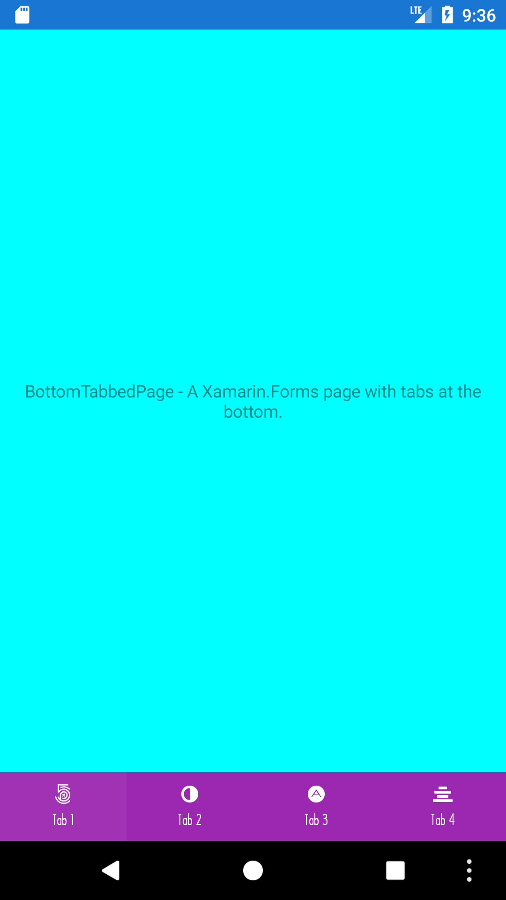
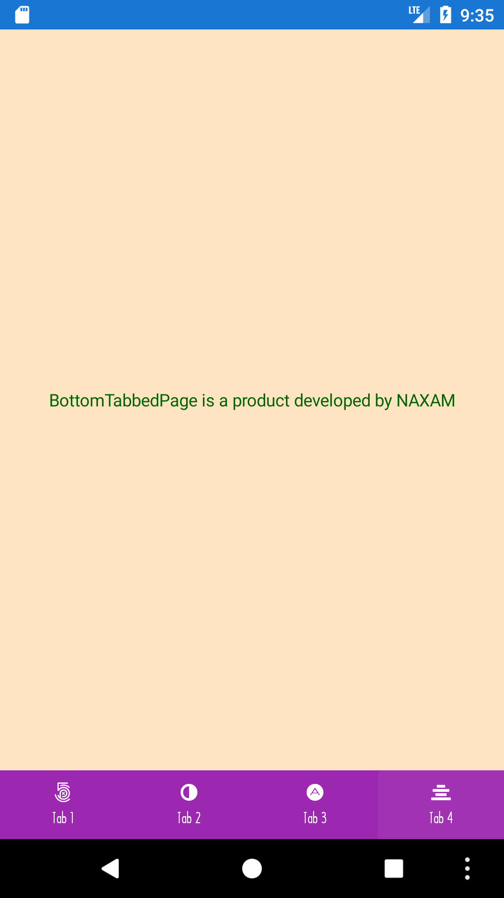

# Licence information
This is a fork of the repository https://github.com/NAXAM/bottomtabbedpage-xamarin-forms.
This repository is licenced under Apache License Version 2.0, January 2004.
According to these licence it is allowed to "reproduce and distribute copies of the
Work or Derivative Works thereof in any medium, with or without
modifications, and in Source or Object form, provided that You
meet the following conditions:"
(a) You must give any other recipients of the Work or Derivative Works a copy of this License.
(b) You must cause any modified files to carry prominent notices stating that You changed the files
(c) You must retain, in the Source form of any Derivative Works that You distribute, all copyright, patent, trademark, and attribution notices from the Source form of the Work, excluding those notices that do not pertain to any part of the Derivative Works;
(d) If the Work includes a "NOTICE" text file as part of its distribution, then any Derivative Works that You distribute must include a readable copy of the attribution notices contained within such NOTICE file, excluding those notices that do not pertain to any part of the Derivative Works, in at least one of the following places: within a NOTICE text file distributed as part of the Derivative Works; within the Source form or documentation, if provided along with the Derivative Works; or, within a display generated by the Derivative Works, if and wherever such third-party notices normally appear. The contents of the NOTICE file are for informational purposes only and do not modify the License. You may add Your own attribution notices within Derivative Works that You distribute, alongside or as an addendum to the NOTICE text from the Work, provided that such additional attribution notices cannot be construed as modifying the License.

* Concerning (a) my duty is done by providing this link to the Apache [LICENSE](./LICENSE)
* Concerning (b) I added a header to the following files as changed by me along with a short description of the change:
```
Demo.Droid/MainActivity.cs
BottomTabbedPageDroid/Utils/SizeUtils.cs,
BottomTabbedPage.Droid/BottomTabbedRenderer.Tabs.cs
BottomTabbedPage.Droid/BottomTabbedRenderer.cs
```
* Concerning (c): I did not remove any copyright, patent, trademark, and attribution notices.
* Concerning (d): At the time of forking there was no NOTICE text file as part of the original distribution.

# BottomTabbedPage
A Xamarin.Forms control brings BottomNavigationView for bottom navigation on Android

|||
|:---:|:---:|

## About
This project is maintained by Naxam Co.,Ltd.<br>
We specialize in developing mobile applications using Xamarin and native technology stack.<br>

**Looking for developers for your project?**<br>

<a href="mailto:tuyen@naxam.net"> 
</a> <br>

## What's inside
BottomNavigationView is a new control since Android Support Design v25. This source code demonstrate the way to bring it into Xamarin.Forms.

However, BottomNavigationView is very limited from customizing, we have to employ library BottomNavigationViewEx as a patch.

In this code, we have
- A custom BottomTabbedPage
- A custom BottomTabbedRenderer

We could 
- change color of background, text of the bar, each item
- chagne the height of the bar
- change text typeface

# Depedendencies

- BottomNavigationViewEx [nuget](https://www.nuget.org/packages/Naxam.Ittianyu.BottomNavExtension/)

## How to use

### Install NUGET package
```
Install-Package Naxam.BottomTabbedPage
```

### Add XML namespace in your XAML
```xml
xmlns:naxam="clr-namespace:Naxam.BottomNavs.Forms;assembly=Naxam.BottomNavs.Forms"
```

### Change the root element to BottomTabbedPage (change the code behind as well)
```xml
<naxam:BottomTabbedPage
    xmlns="http://xamarin.com/schemas/2014/forms"
    xmlns:x="http://schemas.microsoft.com/winfx/2009/xaml"
    xmlns:local="clr-namespace:Demo"
    xmlns:naxam="clr-namespace:Naxam.BottomNavs.Forms;assembly=Naxam.BottomNavs.Forms"
    x:Class="Demo.MainPage">
    <local:Page1 />
    <local:Page2 />
    <local:Page3 />
    <local:Page4 />
    <local:Page5 />
</naxam:BottomTabbedPage>
```

### Change the colors/heights in your activity class
```c#
BottomTabbedRenderer.BackgroundColor = new Android.Graphics.Color(23, 31, 50);
BottomTabbedRenderer.FontSize = 10;
BottomTabbedRenderer.IconSize = 20;
BottomTabbedRenderer.ItemTextColor = stateList;
BottomTabbedRenderer.ItemIconTintList = stateList;
BottomTabbedRenderer.Typeface = Typeface.CreateFromAsset(this.Assets, "HiraginoKakugoProNW3.otf");
BottomTabbedRenderer.ItemBackgroundResource = Resource.Drawable.bnv_selector;
BottomTabbedRenderer.ItemSpacing = 8;
BottomTabbedRenderer.ItemPadding = new Xamarin.Forms.Thickness(8);
BottomTabbedRenderer.BottomBarHeight = 80;
BottomTabbedRenderer.ItemAlign = BottomTabbedRenderer.ItemAlignFlags.Center;
```

### Use Iconize for menu item
```c#
BottomTabbedRenderer.MenuItemIconSetter = (menuItem, iconSource) => {
    var iconized = Iconize.FindIconForKey(iconSource.File);
    if (iconized == null)
    {
        BottomTabbedRenderer.DefaultMenuItemIconSetter.Invoke(menuItem, iconSource);

        return;
    }

    var drawable = new IconDrawable(this, iconized).Color(Color.White).SizeDp(20);

    menuItem.SetIcon(drawable);
};
```

## Source Code
- Naxam.BottomNavs.Platform.Droid/*.cs
- Naxam.BottomNavs.Forms/BottomTabbedPage.cs

## Credits
This library currently uses `BottomNavigationViewEx` from @ittianyu [BottomNavigationViewEx](https://github.com/ittianyu/BottomNavigationViewEx) library.

## License

BottmTabbedPage is released under the Apache License license.
See [LICENSE](./LICENSE) for details.
